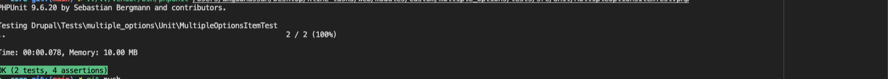

# Multiple Options Field Module

## Overview

The **Multiple Options** field module provides a custom field type that allows users to select multiple options using checkboxes. Each selected checkbox triggers a conditional select list with size options ("Small", "Medium", "Large"). The selected options and sizes are stored in a serialized format and rendered in a user-friendly manner.

## Features

- **Custom Field Type:** Defines a "Multiple Options" field type.
- **Configurable Options:** Admins can configure the number of options available via a settings form.
- **Dynamic Widget Behavior:** Checkboxes dynamically trigger select lists when selected.
- **Serialized Storage:** Selected values are stored as a serialized array in the database.
- **Custom Formatter:** Renders the selected options and their corresponding sizes.

## Installation

1. Clone the repository or download the module.
2. Place the module in the `modules/custom/` directory of your Drupal installation and you can change the number of options from here `/admin/config/multiple_options/settings`
3. Enable the module by navigating to **Extend > Custom > Multiple Options Field** or using Drush:

   ```bash
   drush en multiple_options -y


## Video link
you can see video link for the module from here https://www.loom.com/share/32f17d817f364859b73a207ddc1cef79?sid=40b6f2c7-6477-4adc-9c66-1e4a01b9a827

## Test Results

Here are the results of the unit tests for the `MultipleOptionsItem` class:

